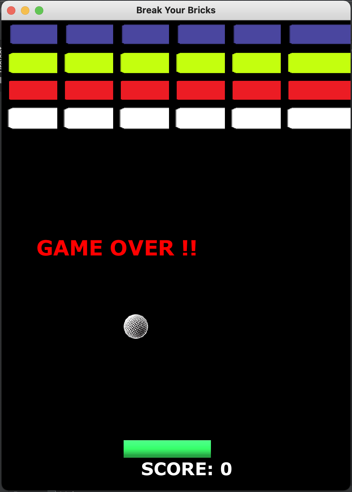

## BTECH PROJECT - Bricks (Recreated)

Creating a game of Bricks in Java was my final year project.
Although, I dont have the old codebase, I thought of creating the project using `Java 8`.
At the time of my final year, i think we have only Java SE 5.

### Project Structure
    .
    ├── ...
    ├── src
        │── bricks
            │── GameBlock.java
            │── GamePlay.java
        │── resources
            │── images
                │── Ball.png
                │── bar.png
                │── Blue-Brick.png
                │── Grey-Brick.png
                │── NewBall.png
                │── Red-Brick.png
                │── Yellow-Brick.png
        |── Main.java
    |── readme.md
    |── bircks.png
    └── ...

### How to play this game
1. Run the main program
2. You should see a JFrame window appearing with the below content

3. Press `Enter` to start the game.
4. Use `Left` and `Right` keys to navigate the paddle.
5. Your score would get auto-calculated. 
6. At all times, the ball should be above the paddle. 
7. Game is over when all the bricks are destroyed, or the ball goes below the paddle

## ENJOY!!

